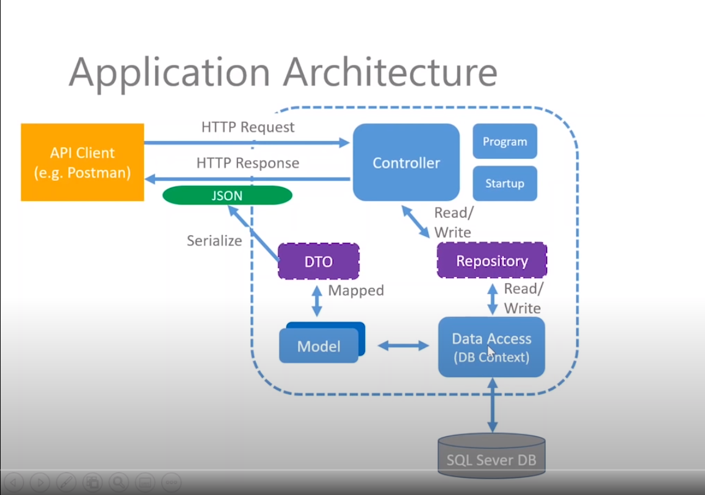
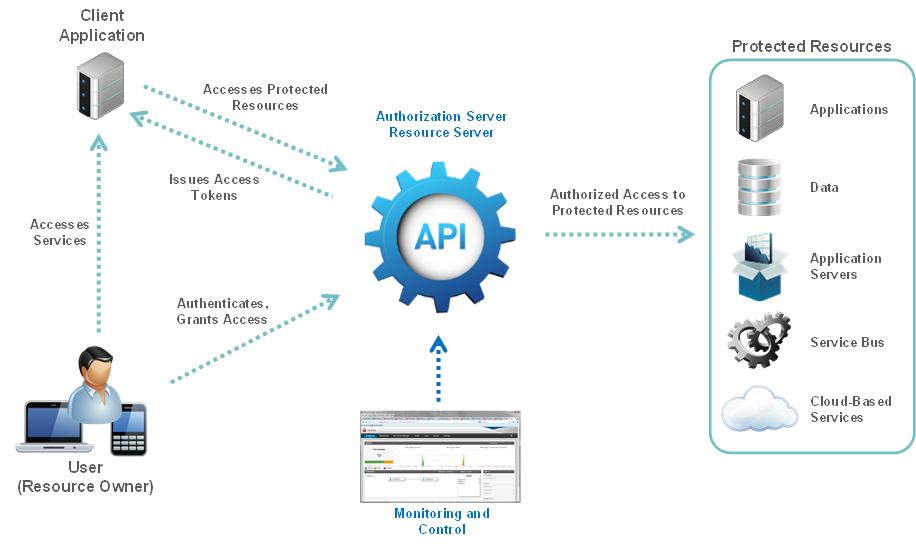

# Oportuno

Code Base para API do "Oportuno APP"

API realizara CRUD, sendo o mediador entre o phone app e os recursos no web server

Arquitetura do API :

Modelo de autorizacao oauth 2:

# Recursos para estudar
https://docs.oracle.com/cd/E50612_01/doc.11122/oauth_guide/content/oauth_intro.html
https://www.youtube.com/watch?v=fmvcAzHpsk8
https://azure.microsoft.com/en-us/services/cosmos-db/
https://www.tutorialsteacher.com/webapi/web-api-tutorials
